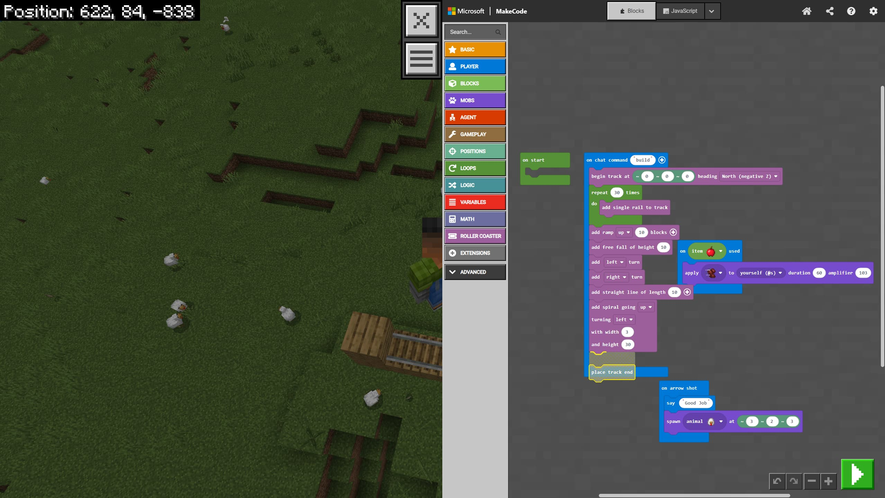

This Christmas marked a big milestone in the Sr. Jr. household. Fifi (Jr.) finally unwrapped his very first desktop PC.

As a father, seeing his face light up was amazing. But as a software engineer with two decades in the industry, I felt a familiar tension. I know all too well that a computer can be two very different things: it can be a **black hole for consumption**, or it can be a **canvas for creation**.

My goal for Filip isn’t necessarily to turn him into a professional coder by age 10. My goal is to steer him from being a passive consumer to an active producer. I want him to look at a screen and think, *"How was this made?"* rather than just *"Let me watch this."*

But as we quickly learned, you can’t just hand an 8-year-old a shiny new PC and expect them to build the next Facebook.

## The "I Don't Know What To Do" Trap

The first few days were telling. Without direction, the default behavior kicked in instantly. If I wasn't looking, the creative tools closed, and YouTube opened.

This is where the **"Guidance"** piece is critical. Kids have infinite imagination, but they often lack the roadmap to translate that imagination into instructions a computer understands. When they hit a wall, they get bored. When they get bored, they consume content because it’s easy.

We needed a bridge. We needed a way to introduce logic without the frustration of typing complex syntax.

## Enter Minecraft Education Edition

We decided to dive deeper into **Minecraft Education Edition**. It’s perfect because it meets the child where they are. Fifi already knows the mechanics of Minecraft—he knows what a rail is, he knows what a chicken is. Suddenly, programming isn't abstract math; it's a superpower in a world he already understands.

## Visual Code Building: Logic Over Syntax

We don't sit in a text editor writing Java or Python just yet. Instead, we use block-based tools like **MakeCode** (shown in the image above) or **Scratch**.

For an adult developer, a missing semicolon or a typo causes a compile error. For an 8-year-old, it causes a meltdown.

Visual code blocks remove that barrier. They snap together like puzzle pieces. If two blocks don't fit, they don't snap. This allows Filip to focus entirely on the logic—the **"Algorithm"**—rather than the syntax.

- He can clearly see that a "Repeat" block wraps around the "Build Rail" block, visually teaching him the concept of a loop.
- It turns coding into something tangible that looks and feels like building with Lego.

## Our Path: From Tutorials to Challenges

We didn't just jump into the deep end. We had a strategy:

1. **Start with the "Cool Factor"**: We picked a couple of tutorials that immediately grabbed his attention. The winner? A script that made it "rain chickens from the sky." It was hilarious, chaotic, and instantly hooked him on the power of code.
2. **Teach Them to Learn**: My role wasn't just to give him answers, but to teach him how to use the tutorials. We walked through how to read the steps, where to find the blocks, and how to verify his work. This empowers him to explore on his own later.
3. **The "Challenge" Phase**: Once he got familiar with the basics, I noticed the "I don't know what to do" problem creeping back in. That's when I switched to giving him specific challenges.

> "Okay, you know how to place blocks. Can you write a command that automatically builds a platform under your feet as you walk?"

## Learning Through "Stupid" Mistakes

Take a look at the screenshot again. This is a snippet from our latest session. We were trying to automate building a roller coaster because placing rails one by one is "boring" (a classic programmer motivation!).

The script includes loops to build tracks, spirals to go up, and—of course—spawning animals. This is where the real magic happens: **I let him do stupid things.**

- *"Dad, what happens if I change the loop from 30 times to 3,000 times?"*
- *"Dad, can I make the chickens explode?"*

My answer is always: **"Try it."**

Sometimes the game crashes. Sometimes he builds a spiral so high it hits the sky limit. Sometimes he accidentally encases his character in solid rock.

These aren't failures; they are the best lessons. When the game lags because he spawned 500 pigs, I don't just say "don't do that." We talk about why it happened. We talk about memory, about processing power, and about loops. He learns debugging not because it's homework, but because he wants his roller coaster to work.

## The Takeaway

If you are a parent looking to introduce coding:

- **Don't expect them to self-teach.** Sit with them. Be the "Senior Dev" to their "Junior."
- **Use tools they love.** Minecraft Education Edition or Scratch are fantastic because the visual feedback is immediate.
- **Embrace the chaos.** Let them break the code. Let them make the game weird. That’s where the joy of creation lives.

We are just getting started with our roller coaster scripts (and apparently, chicken spawners), and I can't wait to see what Jr. breaks—I mean, builds—next.