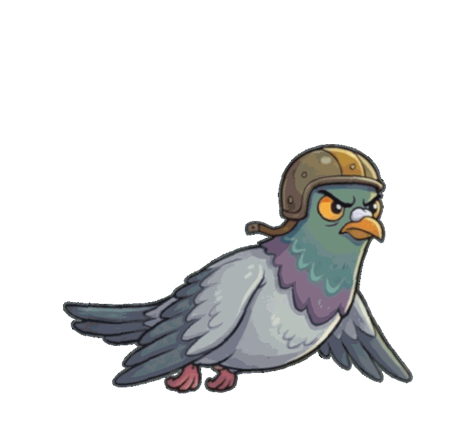

If you’ve followed our journey at **Sr. Jr. Games**, you know that while I bring 20 years of software engineering experience to the table, I am decidedly not a professional animator.

Filip (Jr., age 8) is our creative powerhouse. He dreams up the characters—like the star of our upcoming project, a pigeon with very specific fashion sense. But when Filip says, *"Dad, make the pigeon fly,"* the reality of game development hits. Traditional frame-by-frame animation is beautiful, but for a two-person team (where one of us has a bedtime and the other has a day job), it’s a massive bottleneck.

We needed a way to generate sprites quickly without losing the charm of Filip’s original character design.

Enter **AI**.

## The Problem: The "Hallucinating" Artist

Most people know that Generative AI can make pretty pictures. But if you ask an AI to "draw a pigeon" five times, you get five different pigeons. Different beak sizes, different lighting, different styles.

In game dev, **consistency is king**. If frame A doesn't look exactly like frame B, the animation jitters and breaks the immersion. We needed the exact same pigeon, just moving its wings.

## Our Solution: The "Anchor Image" Workflow

After a lot of trial and error with *"Nano Banana"* (our internal working title), I found a workflow that actually works. It bridges the gap between a static image and a fluid animation sheet.

The secret isn't a complex LoRA or training a custom model (though those are cool). It’s about being incredibly specific with a **multimodal AI** (one that can "see" images) and using mathematical language for the poses.

### Step 1: The Base Reference
First, we take the "master" image. This is the character Filip approved. Let's call it `image_98d44e.jpg`.

### Step 2: The Prompt
I upload the reference image to the chat and use a prompt that treats the AI less like an artist and more like a **geometry engine**.

Here is the actual prompt structure I used to get our pigeon flight cycle:

```plaintext
Image of the pigeon from [uploaded_image_name] in following poses:

A. Exact as [uploaded_image_name] but wings leveled, both wings pointing backwards
B. Exact as [uploaded_image_name] but wings 20 degrees down
C. Exact as [uploaded_image_name] but wings 45 degrees down
```



*Result: you obviously need to stich the frames together to create a smooth animation.*

## Why This Works

*   **"Exact as..."**: This command is crucial. It forces the model to cling to the reference image features—the color palette, the specific tie the pigeon is wearing, and the eye shape.
*   **Explicit Angles**: By using degrees (*"20 degrees down"*), I’m speaking a language the computer understands perfectly. Vague terms like "flapping a little bit" yield vague results. **Numbers yield precision.**
*   **Batching**: Asking for poses A, B, and C in one go often helps the AI maintain style consistency across the batch.

## The Junior Verdict

When I showed the raw output to Filip, I was nervous. He’s the strictest Art Director I’ve ever worked with.

His verdict? 
> "Ideally, he needs to flap faster, but he looks like the right bird."

That’s a win in my book.

## Final Thoughts

This workflow hasn't replaced the work—I still have to cut out the background, stitch the sprite sheet in our engine, and tweak the timing. But it has transformed a task that used to take me a weekend into one that takes a lunch break.

For parents teaching their kids to code: **these tools allow us to say "Yes" to their wild ideas much more often.** And that keeps the magic alive.